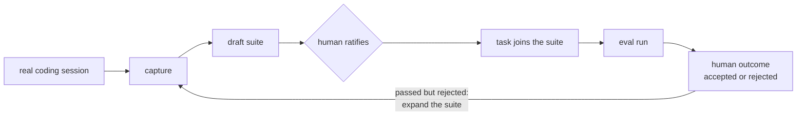

# ForwardEval

**Measure what the agent actually does: task by task, turn by turn.**

**Live dashboard:** https://johnaantony.github.io/forwardeval/ (renders committed sample runs)

ForwardEval is an **agentic coding-evaluation harness** plus a **results dashboard**. It runs a coding agent (Claude, via the Anthropic API with tool use) against a suite of small, real-world-style coding tasks. It verifies each result with **deterministic tests**, captures the full agent transcript, classifies *why* failures happen, and visualizes performance across four lenses: overall, by category, across runs, and **per token spent**.

It exists to answer the one question every team shipping an LLM coding feature has to answer: *did this change actually make the model better at writing code, and at what cost?*

> Built as a portfolio artifact for evaluation-focused product and engineering work. The design choices below are the point: they demonstrate eval judgment, not just code.

## Who it's for

ForwardEval is useful to anyone who ships, or depends on, AI-written code and needs an honest answer to "does it work, and did this change make it better?"

- **Forward Deployed Engineers.** You drop into a customer, build an agent or a feature fast, and have to prove two things on a deadline: that it works, and that each new change did not break the last one. ForwardEval is that proof, packaged.
- **Model Performance and Evaluation PMs / researchers.** Owners of the "is this model or agent change ready to ship?" decision, who live in pass rates, regressions, and capability gaps.
- **AI and applied-AI engineers** building coding agents or LLM features, who need a regression net as they iterate.
- **ML and research engineers** designing or running task suites and benchmarks.
- **Platform and infrastructure engineers** embedding LLMs into a product and needing a release gate for agent quality.
- **QA, release, and DevEx engineers** who want AI-generated changes verified before they merge.
- **AI product managers** translating eval signal into roadmap and ship decisions.
- **Solutions and sales engineers** who need to show, with evidence, that a deployed solution creates measurable value.

What they all get:

- **Did the agent actually solve the task?** Real tests decide, not an opinion and not another LLM.
- **Did this change regress anything?** One screen lists every task that flipped from pass to fail.
- **Is it worth the spend?** Every result is priced in tokens and dollars, so you see accuracy *per dollar*, not just accuracy.
- **Where does it break, and why?** Open any task for the full turn-by-turn transcript and a plain-English failure reason.

It is local, free, and has no vendor lock-in. Point it at the toy task suite included here, or at your own repository's test suite.

---

## The thesis (read this first)

**The tests decide pass/fail. The LLM is used only to *explain* failures, never to judge them.**

The moment your grader is the same kind of thing you are grading, your numbers stop meaning anything. So ForwardEval makes a real test suite the single source of truth for correctness, and uses a Claude call only to tag the failure mode of an already-failed task. That is the difference between a measurement and a vibe.

A second, equally deliberate choice: ForwardEval reports **accuracy per token**, not just accuracy. A model that passes more tasks while burning three times the tokens may be the *worse* ROI. Most coding benchmarks hide this; ForwardEval puts it on the front page.

---

## What's new in 0.4: closing the loop

Every 0.4 capability answers one question: **where does the metric say green when the truth is red?** Version 0.3 already answered one form of it (`llm_missed`: LLM-written tests pass code the expert suite catches). 0.4 extends the same instinct two layers out, then lets reality correct the suite:

| Layer | The green claim | The red truth | Metric |
|---|---|---|---|
| Test authorship (0.3) | LLM-written tests pass | Expert tests fail | `llm_missed` |
| Judge calibration (new) | An LLM judge agrees with the verdict | It only agrees on some task types | agreement band per category |
| Outcome (new) | Tests pass | A human rejected the change anyway | `passedButRejected` |
| Capture (new) | The suite is green | The suite never asked the question | provenance: captured vs authored |

### Judge calibration: a trust score instead of a rule

**Problem:** "never use an LLM judge" is a good default and a bad absolute; teams use judges anyway, with no evidence about when they can. **Answer:** ForwardEval already runs an expert suite and an LLM-authored suite on the same solution, so it turns that comparison into a per-category trust score with a Wilson 95% interval and a band: `autonomous` (a judge can gate unsupervised), `supervised` (judge triages, human confirms), `unsafe` (deterministic only), or `insufficient_data` (too few samples to claim anything, said out loud). The Judge calibration tab is the answer; the authorship table below it is the evidence.

### Metric layers: correctness, behavior, outcome

**Problem:** a binary pass/fail hides how the agent got there and whether a human kept the result. **Answer:** three layers per task. L1 is the deterministic verdict (unchanged). L2 derives behavior from the transcript already being recorded: tool calls, rework loops after the first test run, first-try pass rate. L3 records what only a person can say, with one command:

```bash
node scripts/outcome.mjs --task word-count-edgecases --rejected --note "correct but rewrote the public API"
```

The cross-layer headline is **passed but rejected**: tests green, human said no. It is the same shape of insight as `llm_missed`, one layer further out, and the honest counterweight to any pure test-verdict story.

### Session capture: real sessions become eval cases

**Problem:** a frozen, synthetic suite keeps grading yesterday's target and reports green with total confidence, while every real coding session produces exactly what the suite lacks: a task someone cared about and a definition of done that emerged from doing the work. **Answer:**

```bash
npm run capture -- --session examples/captured-session.example.json
```

Capture scaffolds a task from a real session (prompt, starting code, final code), drafts candidate assertions, and stops. **A human ratifies what "done" means** before the case can grade anything: review the draft, rename it to `test_suite.py`, flip `reviewStatus` to `human_reviewed`, and pass the sanity gate (stub fails, reference passes). That review step is the design, not a limitation: the tool drafts, the person who did the work decides what the result must guarantee. Two of the bundled tasks (`slugify-url-handles`, `retry-with-backoff`) arrived through exactly this path, and the dashboard badges them `captured`.



---

## What it proves

1. **Agentic eval design.** The agent works in a real loop (read, edit, run tests, react) with tool use, not one-shot prompting. The transcript shows every tool call and its result.
2. **Deterministic, reproducible measurement.** Pass/fail comes from running real test suites in a sandbox. Model, temperature, turns, tokens, and timestamps are recorded so a run is auditable and repeatable.
3. **Transcript-level capability-gap analysis.** Every failure is classified into a fixed taxonomy and made explorable turn by turn.
4. **Synthesis a decision-maker can use.** A dashboard that turns task-level results into ship-relevant signal: pass rate by category and difficulty, failure-mode distribution, run-to-run comparison (model A versus B, or prompt v1 versus v2), and token ROI.

---

## Quickstart

Prereqs: Node 18+, Python 3.9+ (`python3` on PATH), and an Anthropic API key.

```bash
# 1) Harness
cd harness
npm install
cp ../.env.example ../.env     # then put your ANTHROPIC_API_KEY in .env

# sanity-check the task suite (no API key needed):
node ../scripts/sanity-tasks.mjs

# run a real eval (pass@1 over all tasks):
npm run eval -- --model claude-sonnet-5 --label sonnet5-baseline

# compare another model or prompt (Claude 5 family and Opus 4.x supported):
npm run eval -- --model claude-fable-5 --label fable5-baseline
npm run eval -- --model claude-opus-4-8 --label opus-baseline

# 2) Publish results + dashboard
cd ../dashboard
npm install
npm run sync         # copies results/*.json into dashboard/public/results
npm run dev          # open the dashboard locally
```

No API key yet? The repo ships with **demo runs** so the dashboard renders immediately:

```bash
node scripts/make-demo.mjs && node scripts/sync-results.mjs
```

In the demo files the **test verdicts are real** (Python is actually executed against the hidden suites); only the transcripts and token counts are simulated. They are clearly flagged in the UI and are replaced by any real run.

### CLI options

| Flag | Default | Meaning |
|------|---------|---------|
| `--model <id>` | `claude-sonnet-5` | Agent model (compare models side by side); Claude 5 family (`claude-fable-5`, `claude-sonnet-5`) and Opus 4.x supported |
| `--max-turns <n>` | `6` | Max agent turns per task |
| `--temperature <t>` | `0` | Sampling temperature. Ignored on the Claude 5 family and Opus 4.7+ (those models reject sampling params, so the harness omits it automatically) |
| `--attempts <k>` | `1` | Attempts per task, for pass@k |
| `--label <name>` | model id | Run label (used in Run Comparison) |
| `--tests <mode>` | `human` | Who authors the suite: `human` (expert only), `llm` (LLM-authored suite is the verdict), or `both` (run both, human authoritative, LLM shadow). See [Test authorship](#test-authorship-human-expert-vs-llm-authored-tests). |
| `--only <id,id>` | all | Run a subset of tasks |
| `--input-price` / `--output-price` | model list price | USD per 1M tokens (Cost view) |
| `--no-pricing` | off | Disable the Cost view (Tokens still shown) |
| `--outcomes <file>` | `outcomes.json` | Layer-3 human-acceptance sidecar merged into results (record entries with `node scripts/outcome.mjs`) |

---

## How it works

```
tasks/<id>/            inputs you author
  task.json            metadata (category, difficulty, prompt, test_command)
  solution_stub.py     buggy/incomplete code the agent edits
  test_suite.py        HIDDEN verifier (excluded from the agent's workspace)

harness/src/
  agent.ts             the agentic loop: tool use (read_file/write_file/run_tests)
  sandbox.ts           isolated temp dir, hard timeout, best-effort no-network
  verify.ts            authoritative final verification (re-runs hidden tests)
  classifier.ts        failure-mode tagger (analysis only, never the verdict)
  cost.ts / report.ts  Tokens + Cost + ROI rollups into results/<run-id>.json

dashboard/             reads results JSON: Overview, Task Explorer + Transcript, Run Comparison
```

The loop, per task: the harness frames Claude as a coding agent, gives it the prompt and the entry file, and lets it call tools across up to N turns. The agent can **run** the tests (and see stdout, stderr, and the exit code) but **cannot read the test source**. Hidden files are excluded from its workspace and overlaid only at execution time, so it cannot game the checks. When the loop ends, the harness runs the **full hidden suite itself on a clean copy**, and *that* exit code is the verdict.

---

## Task taxonomy and difficulty

17 self-contained Python tasks (stdlib plus `unittest`, zero pip installs): 15 hand-authored plus 2 captured from real sessions via `npm run capture` (badged `captured` in the dashboard). Spread across:

- **Categories:** `bug_fix`, `feature_add`, `refactor`, `edge_cases`, `algo`
- **Difficulty:** `easy`, `medium`, `hard`

Every test suite covers the cases named in the prompt **plus hidden edge cases the prompt does not spell out**. That gap is what separates "looks right" from "is right." Each task is sanity-checked (`scripts/sanity-tasks.mjs`) to guarantee the stub *fails* and a reference solution *passes*; otherwise the bug is not real, or the suite is wrong.

## Failure taxonomy

When a task fails, the classifier tags it (one to three tags) from a fixed set, each with a one-line justification:

`misread_spec`, `missed_edge_case`, `regression`, `hallucinated_api`, `incomplete`, `wrong_approach`, `flaky_or_timeout`

This is an **analysis aid**, never the grader.

---

## Why deterministic verification beats LLM-as-judge

The 2025 eval market converged on a hard lesson. LLM judges show **self-enhancement bias, position and verbosity bias, and low self-consistency**, and they **miss exactly the logic errors human experts catch**. Worse, running a judge model over every trace can cost *more than the eval platform itself*. ForwardEval sidesteps all of it for the correctness verdict:

| Common eval-platform complaint (2025) | ForwardEval's answer |
|---|---|
| LLM-judge API bills can exceed platform cost | Judge used only to *explain* failures; **Token ROI** makes eval cost visible |
| Judges are biased, inconsistent, and miss logic errors | **Deterministic tests are the verdict.** Zero judge bias on pass/fail |
| Final-output grading misses 20-40% of agent failures at the step level | **Turn-by-turn Transcript Viewer plus failure taxonomy** evaluate the trajectory |
| Eval results do not gate deploys | Run Comparison and the regression flip-list are designed as a **CI gate** |
| Framework lock-in (for example, one orchestration library only) | Framework-agnostic: direct Anthropic SDK |
| Seat-based pricing and trace quotas | **Local and free.** No seats, no quota |

See [EVAL_DESIGN.md](EVAL_DESIGN.md) for the full methodology and trust argument.

---

## Test authorship: human expert vs LLM-authored tests

Deterministic tests are only as good as the scenarios someone thought to write. A use-case expert knows the unusual inputs that matter in their domain; an LLM asked to write tests may simply not think of them. ForwardEval makes that gap measurable.

Two sources can author the deterministic suite:

- **Human expert** (default): the hand-written `test_suite.py`, the verifier ForwardEval has always used.
- **LLM-authored**: Claude writes a `unittest` suite from the prompt and the stub alone, never having seen the expert's suite.

This is **not** LLM-as-judge. The LLM writes the tests up front; those tests then run deterministically and their exit code is the verdict. The risk it surfaces is exactly the expert's worry: the model may not think of the edge case, so its suite passes code the expert's suite would fail.

```bash
npm run eval -- --tests human          # expert suite only (original behavior)
npm run eval -- --tests llm            # LLM-authored suite is the verdict (human runs as shadow)
npm run eval -- --tests both           # both run; human authoritative, LLM shadow; full comparison
```

In `both` and `llm` mode the **same agent solution** is scored by both suites, and each task is labeled:

| Label | Meaning |
|---|---|
| `agree_pass` / `agree_fail` | both suites reach the same verdict |
| **`llm_missed`** | the LLM suite PASSES but the expert suite FAILS: the LLM did not test an edge case the expert caught (false confidence) |
| `llm_stricter` | the LLM suite FAILS but the expert suite PASSES: over-constrained, or it caught something the expert did not |

The **Test authorship** tab in the dashboard rolls this up: agreement rate, `llm_missed` count (the headline), pass@1 under each author, how many test cases each side wrote, and the token cost of LLM test generation. Click any task to read the LLM-generated test file next to both verdicts.

In the bundled demo run, the LLM-authored suites pass two solutions the expert suite catches as buggy (`word-count-edgecases`, `token-bucket-rate-limiter`), the expert wrote 47 test cases to the LLM's 18, and the LLM suite shows a *higher* pass rate than the expert suite. That higher number is the trap: more green, less truth. The point is not that LLM-authored tests are useless (on most tasks here they agree); it is knowing **which** tasks still need the expert.

## Adding a task

1. Create `tasks/my-task/` with `task.json`, `solution_stub.py` (containing a real bug), and `test_suite.py` (`unittest`, including hidden edge cases).
2. Add a reference solution at `scripts/references/my-task.py`.
3. Run `node scripts/sanity-tasks.mjs` to confirm the stub fails and the reference passes.

## Reproducibility and privacy

- Every run records the model, temperature, max-turns, attempts, timestamps, and harness version in `results/<run-id>.json`.
- **No third-party telemetry, no PII, no hidden collection.** The only outbound network call is to the Anthropic API. Results are plain local JSON. Candidate code runs in a sandbox with the network denied (best-effort: macOS `sandbox-exec`, Linux `unshare`). It is open source, so you can verify all of this yourself.
- **Never commit your API key.** It is read from `.env` (gitignored); see `.env.example`.

## Limitations

- 17 single-file tasks are not repo-level engineering. This is a faithful *miniature* of SWE-bench, not a replacement.
- Per-category calibration bands rest on small samples today (3 to 5 compared tasks per category). The Wilson intervals and the `insufficient_data` band exist precisely so the report cannot over-claim; capture is how the samples grow.
- Layer-3 outcomes are only as good as the humans recording them; an unrecorded outcome is a blind spot, not an acceptance.
- The agent's `run_tests` and the final verdict run the same suite; "hidden" means hidden from the agent's *file reads*, not from execution.
- The OS sandbox is best-effort. For untrusted code at scale, run it inside a container.
- Demo token counts are simulated; real runs record true API usage.

## Roadmap

The roadmap to **real SWE-bench**, and the **Layer 2 vision** (the eval also recommending the product events to instrument, so you can measure whether shipped code is *valuable to customers* and not merely correct), lives in [ROADMAP.md](ROADMAP.md). Layer 2 is the part almost nobody else can credibly build.

## Deploy

Run `cd dashboard && npm run build`, then deploy `dashboard/dist` to Vercel or GitHub Pages. Setting `base: "./"` makes the build portable to either. A GitHub Actions workflow for Pages is included.
